# Untangled Nexus: Quote-to-Invoice and Customer Accounts Manual

**Audience:** Untangled IT Solutions product, development, operations, finance and management teams  
**Status:** Implementation specification  
**Branch baseline:** `nexus-reliability-notifications`  
**Last updated:** 1 October 2026

## 1. Purpose

This manual defines how Nexus must evolve from the current automated quotation workflow into a controlled quote-to-cash system that supports:

- distributor price imports;
- customer quotation generation and approval;
- invoice creation from the accepted quotation;
- invoice delivery, payment allocation and overdue tracking;
- customer accounts for SLA and frequent customers;
- customer self-service profiles on the website;
- account statements with opening balances and transaction histories; and
- arrears notifications and account holds.

This is a product and engineering specification, not accounting, tax or legal advice. Finance and the company's tax adviser must approve invoice timing, payment terms, credit-control rules and final document wording before production rollout.

## 2. Current Baseline

The branch already provides the following foundation:

- management can import distributor `.xlsx` and `.xls` quotations;
- Nexus identifies priced rows and ignores unpriced configuration components;
- markup defaults to 25% but can be changed per quotation;
- calculations use exact decimal arithmetic;
- the quotation shows subtotal excluding VAT, VAT and total including VAT;
- quotation validity defaults to 14 calendar days;
- quotation revisions are retained;
- supplier cost and markup remain internal;
- the customer PDF links to the public quotation terms page; and
- the quotation workflow and data are isolated from `main`.

The next work must extend this baseline rather than replace it.

## 3. Core Accounting Rule

An accepted quotation must never be overwritten or renamed into an invoice.

Nexus must:

1. lock the accepted quotation revision;
2. create a separate invoice record derived from that exact snapshot;
3. retain links between the quote, invoice, customer account, payments and later credit notes; and
4. preserve a permanent audit trail showing who performed each transition and when.

This protects the commercial agreement and allows the company to prove what the customer approved.

## 4. Document Terminology

Use the following document types consistently:

| Document | Purpose | Financial effect |
|---|---|---|
| Quotation | Commercial offer with a validity period | No amount is owed |
| Pro forma invoice | Payment request or preview before the tax invoice event | Does not post to the formal receivables ledger unless Finance approves that policy |
| Tax Invoice | Formal invoice containing required supplier, recipient, VAT, line and total details | Posts a debit to the customer account |
| Credit Note | Reduces or reverses an issued invoice | Posts a credit to the customer account |
| Payment Receipt | Confirms money received and allocated | Posts a credit to the customer account |
| Statement of Account | Summarises ledger activity and outstanding balances for a period | No new financial posting |

Nexus may create an **invoice draft** automatically when a customer approves a quote. Finance policy must determine whether the first customer-facing document is a pro forma invoice or an issued Tax Invoice. Do not assume that quote approval alone is always the tax-invoice event.

## 5. End-to-End Business Workflow

```mermaid
flowchart LR
    A[Customer quote request] --> B[Operations review]
    B --> C[Distributor price import]
    C --> D[Markup and VAT calculation]
    D --> E[Quotation revision saved]
    E --> F[Customer receives PDF]
    F --> G{Customer decision}
    G -->|Changes requested| B
    G -->|Declined| H[Quote closed]
    G -->|Approved| I[Accepted revision locked]
    I --> J[Invoice draft created]
    J --> K{Finance issue event}
    K -->|Pro forma required| L[Pro forma sent]
    K -->|Tax invoice authorised| M[Tax Invoice issued]
    L --> M
    M --> N[Accounts receivable ledger debit]
    N --> O{Payment received?}
    O -->|Full| P[Paid and receipt issued]
    O -->|Partial| Q[Partially paid]
    O -->|Past due| R[Overdue and arrears workflow]
    Q --> O
    R --> O
    N --> S[Statement of Account]
```



### 5.1 Quote preparation

1. A quote request is created from the website or internally.
2. Operations confirms customer identity, billing details, delivery details and requested items.
3. Operations imports one or more distributor quotations.
4. Nexus presents priced lines for review before saving.
5. Operations may remove lines and edit customer-facing descriptions, quantities, delivery fees and markup.
6. Nexus calculates the ex-VAT subtotal, VAT and VAT-inclusive total.
7. Saving creates a new immutable quotation revision.
8. The quote is sent for customer approval.

### 5.2 Customer approval

Approval must be explicit. Supported approval channels may include:

- authenticated website approval;
- a signed quotation uploaded by Operations;
- an official purchase order; or
- a recorded written acceptance captured by an authorised employee.

The approval record must contain:

- quote ID and revision number;
- approved amount and currency;
- approval channel;
- customer account and contact IDs;
- approver name and email;
- purchase order number, if applicable;
- timestamp in UTC and display timestamp in SAST;
- source IP and user agent for website approvals, where lawful and disclosed; and
- the employee who captured an offline approval.

Approval must be idempotent. Repeating the same request must return the existing invoice draft rather than creating a second invoice.

### 5.3 Invoice creation

When approval succeeds, Nexus must atomically:

1. set the quotation revision to `accepted` and lock it;
2. allocate a unique invoice draft ID;
3. copy customer billing details into an invoice snapshot;
4. copy public quotation lines, quantities, unit prices and VAT values;
5. copy the terms version and customer purchase order reference;
6. calculate payment terms and a proposed due date;
7. create an audit event; and
8. notify Operations and Finance.

If any step fails, none of the steps may be committed.

### 5.4 Tax Invoice issue

Only an authorised Finance, Director or configured Operations role may issue a Tax Invoice.

Before issue, Nexus must validate that the document contains:

- the words `Tax Invoice`, `VAT Invoice` or `Invoice`;
- Untangled IT Solutions' legal name, address and VAT number;
- the customer's legal name and address;
- the customer's VAT number when the recipient is a VAT vendor;
- a unique serial invoice number;
- the issue date;
- accurate goods or services descriptions;
- quantities or volumes;
- value excluding VAT, VAT amount and total including VAT; and
- a clear indication when applicable goods are second-hand.

Nexus should always generate the **full** tax-invoice format, even for smaller transactions. This keeps one consistent template and meets the stricter data set used for invoices over R5,000.

After issue, line values and tax totals are immutable. Corrections require a credit note and, where necessary, a replacement invoice. Never silently edit an issued invoice.

### 5.5 Payment and allocation

Payments must be recorded separately from invoices.

Each payment contains:

- payment ID;
- customer account ID;
- received date;
- amount and currency;
- payment method;
- bank or processor reference;
- captured-by employee;
- proof-of-payment document ID, where provided; and
- one or more invoice allocations.

A payment may be:

- fully allocated to one invoice;
- split across invoices;
- partially allocated with an account credit remaining; or
- reversed through a separate reversal transaction.

Do not delete payment records. Use a reversal with a reason and audit record.

## 6. Numbering Rules

Use server-generated, unique, sequential numbers. Number allocation must be atomic and must never occur in the desktop client.

Recommended formats:

- quotation: `Q-2026-000001`;
- invoice: `INV-2026-000001`;
- credit note: `CN-2026-000001`;
- payment receipt: `RCT-2026-000001`; and
- statement: `STMT-2026-10-CUSTOMER001`.

Cancelled or voided numbers must not be reused. Gaps are acceptable when the audit trail explains them.

## 7. Status Models

### 7.1 Quotation statuses

`received -> assigned -> awaiting_details -> in_review -> quoted -> awaiting_client_approval -> accepted | declined | expired | cancelled`

### 7.2 Invoice statuses

`draft -> pro_forma_sent -> issued -> partially_paid -> paid`

Side states:

- `overdue` is derived when an issued invoice has an outstanding balance after its due date;
- `disputed` pauses automated collection communication but does not erase the balance;
- `void` is allowed only under approved policy and before financial settlement; and
- `credited` means the outstanding value was fully reversed through credit notes.

### 7.3 Customer account statuses

- `active`: normal trading;
- `on_hold`: no new credit orders, but payments and support continue;
- `suspended`: portal and ordering restrictions require management review; and
- `closed`: no new transactions, historical records retained.

Account holds must never delete invoices, payments or statements.

## 8. Customer Account Model

Create one organisation-level customer account and separate contacts/users beneath it.

### 8.1 `customer_accounts`

```json
{
  "id": "object-id",
  "account_number": "CUS-000001",
  "legal_name": "Example Customer (Pty) Ltd",
  "trading_name": "Example Customer",
  "registration_number": "",
  "vat_number": "",
  "billing_address": {},
  "delivery_addresses": [],
  "primary_contact_id": "object-id",
  "account_type": "standard | frequent | sla",
  "payment_terms_days": 0,
  "credit_limit": "0.00",
  "currency": "ZAR",
  "status": "active",
  "credit_control_status": "current",
  "sla_id": null,
  "created_at": "UTC timestamp",
  "updated_at": "UTC timestamp",
  "revision": 0
}
```

### 8.2 `customer_contacts`

Store names, job titles, email addresses, phone numbers, billing roles and communication preferences. A contact is not automatically a website user.

### 8.3 `customer_users`

Customer portal users must reference a customer account and contact. Store password hashes only. Include email verification, session revocation, last-login information and portal roles such as:

- `account_admin`;
- `buyer`;
- `finance`; and
- `viewer`.

Every portal query must enforce the authenticated `customer_account_id`. Never trust an account ID supplied by the browser without checking it against the session.

## 9. Financial Data Model

### 9.1 `invoices`

Required fields:

- internal ID and immutable invoice number;
- source quote ID and accepted revision;
- customer account ID;
- billing-details snapshot;
- supplier-details snapshot;
- issue and due dates;
- currency;
- public line items;
- subtotal excluding VAT;
- VAT rate and amount;
- total including VAT;
- status and outstanding balance;
- purchase order number;
- terms version and terms URL;
- PDF document ID and SHA-256 hash;
- created, issued and updated audit fields; and
- concurrency revision.

Keep internal supplier cost and margin outside the customer-facing invoice snapshot.

### 9.2 `credit_notes`

Credit notes reference the original invoice, include a reason and contain negative or reversing line values. Approval is required before issue.

### 9.3 `payments`

Payments are immutable transaction records. Corrections use reversal entries.

### 9.4 `payment_allocations`

Each allocation joins a payment to an invoice and records the allocated amount. The sum of active allocations may not exceed the payment amount or invoice outstanding balance.

### 9.5 `account_ledger_entries`

Use a ledger as the source of truth for statements:

| Type | Debit | Credit |
|---|---:|---:|
| Issued invoice | Invoice total | 0 |
| Credit note | 0 | Credit total |
| Payment | 0 | Payment amount |
| Payment reversal | Reversal amount | 0 |
| Approved adjustment | Depends on adjustment | Depends on adjustment |

Every ledger entry must reference its source record. Ledger entries are append-only.

## 10. Arrears and Aging

An account is in arrears when at least one issued invoice has:

```text
outstanding_balance > 0 AND due_date < current_SAST_date
```

Age outstanding amounts using the invoice due date:

- current/not due;
- 1-30 days overdue;
- 31-60 days overdue;
- 61-90 days overdue; and
- more than 90 days overdue.

Do not calculate arrears from cached customer balances alone. Recalculate from ledger transactions or verified invoice balances.

Recommended default credit-control workflow:

1. due date: friendly payment reminder;
2. 7 days overdue: first overdue notice;
3. 14 days overdue: Operations and Finance escalation;
4. 30 days overdue: account hold review;
5. 60+ days overdue: Director review; and
6. dispute raised: pause automated notices while retaining the debt and audit trail.

These intervals must be configurable. Do not add interest, penalties or automatic suspension unless the signed customer agreement and approved company policy allow it.

## 11. Statement of Account

A statement is generated for one customer account and one date range.

It must show:

- Untangled IT Solutions legal and contact details;
- customer legal name, account number and billing address;
- statement number, issue date and period;
- opening balance before the period;
- each invoice, credit note, payment and reversal in date order;
- reference, description, debit, credit and running balance;
- current balance;
- aging-bucket totals;
- unapplied credits;
- payment reference instructions approved by Finance; and
- contact details for account queries.

The opening balance is the sum of all ledger entries before the start date. The closing balance is:

```text
opening balance + period debits - period credits
```

Statement generation must be deterministic: the same ledger state and period must produce the same totals.

## 12. API Contract

Implement these routes in the Nexus FastAPI service. Exact naming may follow established repository conventions, but responsibilities must remain separate.

### Quote approval and conversion

```text
POST /api/quotes/{reference}/approve
POST /api/quotes/{reference}/decline
POST /api/quotes/{reference}/request-changes
GET  /api/quotes/{reference}/approval
```

`approve` must accept an idempotency key and return the existing invoice draft when approval has already succeeded.

### Invoices

```text
GET  /api/invoices
GET  /api/invoices/{invoice_id}
POST /api/invoices/{invoice_id}/issue
POST /api/invoices/{invoice_id}/send
GET  /api/invoices/{invoice_id}/pdf
POST /api/invoices/{invoice_id}/void
POST /api/invoices/{invoice_id}/credit-notes
```

### Customer accounts

```text
GET   /api/customer-accounts
POST  /api/customer-accounts
GET   /api/customer-accounts/{account_id}
PATCH /api/customer-accounts/{account_id}
POST  /api/customer-accounts/{account_id}/hold
POST  /api/customer-accounts/{account_id}/release-hold
GET   /api/customer-accounts/{account_id}/aging
```

### Payments and statements

```text
POST /api/payments
POST /api/payments/{payment_id}/allocate
POST /api/payments/{payment_id}/reverse
GET  /api/customer-accounts/{account_id}/ledger
POST /api/customer-accounts/{account_id}/statements
GET  /api/statements/{statement_id}
GET  /api/statements/{statement_id}/pdf
POST /api/statements/{statement_id}/send
```

### Future website portal

```text
POST /api/customer-auth/invite/accept
POST /api/customer-auth/login
POST /api/customer-auth/logout
POST /api/customer-auth/forgot-password
POST /api/customer-auth/reset-password
GET  /api/customer-portal/me
GET  /api/customer-portal/quotes
POST /api/customer-portal/quotes/{reference}/approve
GET  /api/customer-portal/invoices
GET  /api/customer-portal/statements
```

The public website currently uses the Node backend while Nexus uses FastAPI. The team must choose one of these controlled integration patterns before portal work:

1. Node acts as a website-facing gateway and calls the protected FastAPI accounting API; or
2. the website authenticates directly against a dedicated customer-facing FastAPI surface with strict CORS and customer-session controls.

Do not duplicate invoice or ledger logic in both backends.

## 13. Permissions

Minimum recommended access:

| Capability | Operations | Business Lead | Director | Finance role | Customer |
|---|---:|---:|---:|---:|---:|
| Prepare quotation | Yes | Yes | Yes | View | No |
| View supplier cost/margin | Yes | Configurable | Yes | Yes | Never |
| Accept offline customer approval | Configurable | Yes | Yes | View | No |
| Issue Tax Invoice | Configurable | No | Yes | Yes | No |
| Record/allocate payment | No | No | Configurable | Yes | No |
| Issue credit note | No | No | Approve | Prepare/issue | No |
| Place account on hold | Recommend | Recommend | Yes | Yes | No |
| View own documents | No | No | No | No | Yes |

Add a dedicated Finance role before production rather than overloading Director or Operations permissions indefinitely.

## 14. Desktop Screens

### 14.1 Quote Management

Add:

- imported-line review editor;
- quote revision selector;
- `Send for Approval` action;
- approval evidence panel;
- `Create Invoice Draft` result link; and
- clear badges showing quote, pro forma and invoice states.

### 14.2 Invoice Management

Add a separate workspace with:

- invoice list and filters;
- draft validation errors;
- issue, send and download actions;
- payment and allocation history;
- outstanding and overdue indicators;
- dispute and account-hold controls; and
- credit-note workflow.

### 14.3 Customer Accounts

Add:

- account profile and contacts;
- SLA/frequent-customer status;
- payment terms and credit limit;
- current balance and aging summary;
- invoices, payments, statements and disputes tabs; and
- audit history.

### 14.4 Statements

Allow authorised staff to:

- choose an account and date range;
- preview opening balance and transactions;
- generate the statement PDF;
- send it to approved billing contacts; and
- record delivery status without exposing the document to unrelated users.

## 15. Customer Website Experience

### 15.1 Registration and invitation

Frequent and SLA customers should normally be invited from a verified customer account rather than creating unverified organisations freely.

Flow:

1. staff creates or verifies the customer account;
2. staff invites the primary contact;
3. contact verifies the email address;
4. contact creates a password and accepts privacy/portal terms;
5. Nexus links the user to the correct customer account; and
6. an account administrator may invite additional contacts within policy.

### 15.2 Portal capabilities

Customers may:

- maintain permitted contact and delivery details;
- view and approve quotation revisions;
- upload purchase orders;
- view invoices and payment status;
- download receipts and statements;
- view SLA details and support history; and
- raise invoice disputes or account queries.

Customers may never view:

- distributor source files;
- supplier costs;
- markup or margin;
- internal notes;
- another customer's data; or
- employee-only audit information.

## 16. Security and Privacy Requirements

- Enforce customer-account isolation on every server query.
- Use password hashing, short-lived sessions, revocation and rate limiting.
- Require stronger authentication for internal Finance and Director actions.
- Keep billing contacts separate from login identities.
- Collect only information needed for quoting, fulfilment, SLA support and accounting.
- Record a lawful purpose and retention rule for personal information.
- Encrypt transport with HTTPS and protect sensitive stored information appropriately.
- Audit document downloads, approvals, invoice issue, credits, payments and statement sends.
- Never put passwords, supplier cost, bank account details or tokens into PDFs, logs or notification messages.
- Provide correction and access processes for customer data.
- Maintain a documented security-compromise response process.

POPIA requires appropriate, reasonable technical and organisational safeguards for personal information. Privacy and security review is a release gate for the customer portal.

## 17. PDF Requirements

### Tax Invoice PDF

Use the current quotation visual system but display:

- `TAX INVOICE` as the document title;
- invoice number, issue date and due date;
- linked quote and purchase order references;
- customer VAT number when applicable;
- full invoice lines and VAT breakdown;
- amount paid and amount outstanding when appropriate;
- approved remittance instructions; and
- the public terms URL.

### Statement PDF

Use a compact financial table designed for multiple pages. Repeat table headers, include page numbers and show totals that reconcile to the ledger.

Generated PDFs must be hashed and retained with the source snapshot used to create them. Regeneration after issue must reproduce the same financial content.

## 18. Notifications

Create durable notification events for:

- quotation sent;
- customer approved, declined or requested changes;
- invoice draft created;
- Tax Invoice issued and sent;
- payment recorded or reversed;
- invoice partially or fully paid;
- invoice due and overdue;
- account placed on or released from hold;
- statement generated and sent; and
- invoice dispute opened or resolved.

Notifications must be idempotent and auditable. Email delivery failure must not roll back a valid financial transaction; record the failure and allow a retry.

## 19. Implementation Phases

### Phase 1: Invoice foundation

- finalise Finance decisions;
- create invoice and sequence models;
- implement quote approval and idempotent invoice-draft creation;
- create invoice validation and issue endpoint;
- generate branded Tax Invoice PDFs;
- add Invoice Management to the desktop app; and
- test quote-to-invoice concurrency and permissions.

### Phase 2: Payments, ledger and statements

- create payment, allocation and ledger models;
- calculate outstanding balances and aging;
- implement account holds and disputes;
- generate statement PDFs; and
- add Customer Accounts and Statements screens.

### Phase 3: Customer profiles and portal

- build invitation-based customer authentication;
- enforce account-level tenant isolation;
- add quote approval, invoices and statements to the website;
- publish privacy and portal terms; and
- perform security and accessibility testing.

### Phase 4: Controlled automation

- scheduled due/overdue evaluation;
- configurable reminder templates;
- delivery status and retry handling;
- management receivables dashboard; and
- optional accounting-package integration only after requirements and cost approval.

All phases must continue to support a zero-paid-service development and local-staging path.

## 20. Test Plan

### Calculation tests

- decimal rounding at line, VAT and total level;
- partial payments and split allocations;
- credit notes and reversals;
- opening and closing statement balances; and
- every aging-bucket boundary.

### Workflow tests

- repeated approval creates only one invoice;
- expired quotation cannot be approved without authorised override;
- only the accepted revision becomes the invoice;
- issued invoices cannot be edited;
- credit note changes the ledger correctly;
- fully paid invoice cannot become overdue; and
- disputed invoice pauses reminders without removing the balance.

### Permission tests

- customers cannot access other accounts;
- customers never receive internal pricing;
- unauthorised staff cannot issue invoices or credits;
- only approved roles record or reverse payments; and
- statement access is account-scoped.

### Document tests

- mandatory invoice fields are present;
- PDFs render on desktop and mobile viewers;
- multi-page statements repeat headers;
- clickable terms links work;
- no clipped or overlapping text; and
- PDF totals match API and ledger totals exactly.

### Security tests

- login rate limits and session revocation;
- object-level authorisation on every customer document;
- malicious spreadsheet and PDF inputs;
- cross-account identifier tampering;
- formula injection in imported spreadsheets; and
- sensitive-data leakage in logs and error responses.

## 21. Release Gates

The feature is ready for production only when:

- Finance signs off invoice timing, numbering and payment rules;
- a tax adviser or suitably authorised reviewer confirms the invoice template;
- management approves credit limits, arrears and account-hold policy;
- the Information Officer approves the customer-profile privacy design;
- all migrations and indexes have rollback plans;
- API, desktop and website test suites pass;
- invoice and statement PDFs pass visual inspection;
- account-isolation security tests pass;
- production backups and recovery are verified; and
- staging smoke tests cover the complete quote-to-payment journey.

## 22. Decisions Required Before Coding Phase 1

The product owner, Finance and management must answer these questions:

1. On approval, should the customer receive a pro forma invoice first or an issued Tax Invoice?
2. What event authorises Tax Invoice issue: approval, payment, delivery, service start or Finance confirmation?
3. What are the allowed payment terms: COD, 7, 14 or 30 days?
4. Who may approve credit limits and account holds?
5. May Operations record payments, or only Finance?
6. What bank/remittance information may appear on invoices and statements?
7. What is the official invoice-number prefix and financial year rule?
8. Are partial invoices, deposits and progress billing required?
9. What approval is required for credit notes and write-offs?
10. Which billing email addresses are authorised for statements and arrears notices?

Do not hide these decisions in code defaults. Store approved values as configuration with an audit history.

## 23. Developer Definition of Done

A story is complete only when:

- server-side permissions and validation are implemented;
- money uses decimal arithmetic;
- write operations are atomic and idempotent where required;
- audit records identify actor, action, source and timestamp;
- desktop and website network calls remain off the UI thread;
- customer-facing data excludes supplier cost and internal notes;
- automated tests cover success, permission and failure cases;
- generated documents are rendered and visually inspected; and
- documentation and local staging fixtures are updated.

## 24. Authoritative References

- [SARS: Tax Invoices](https://www.sars.gov.za/businesses-and-employers/government/tax-invoices/)
- [SARS: VAT 404 Guide for Vendors](https://www.sars.gov.za/wp-content/uploads/Ops/Guides/Legal-Pub-Guide-VAT404-VAT-404-Guide-for-Vendors.pdf)
- [SARS: VAT Invoice Checklist](https://www.sars.gov.za/wp-content/uploads/Docs/Government/Tax-Invoice-Checklist-Version-2-29032016.pdf)
- [South African Government: Protection of Personal Information Act](https://www.gov.za/documents/protection-personal-information-act)
- [Department of Justice: POPIA Act text](https://www.justice.gov.za/legislation/acts/2013-004.pdf)

